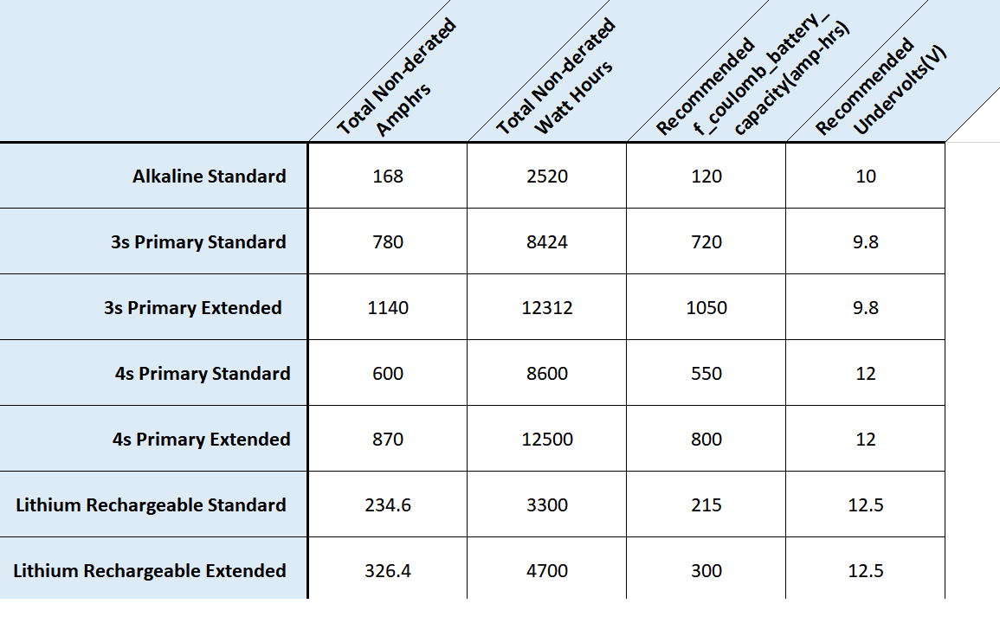
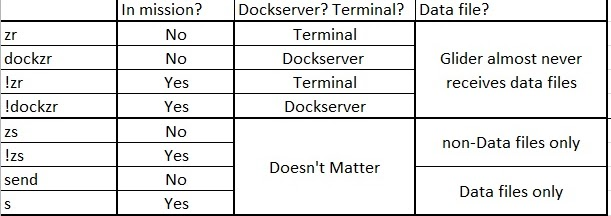
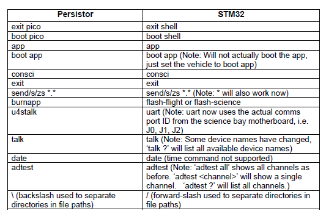

This page contains various procedures and resources for glider lab members, including ESD standard operating procedures, manuals, and piloting tools.

## Gliders and Mooring Google Calendar

[Gliders and Mooring Google Calendar](https://calendar.google.com/calendar/embed?src=noaa.gov_v9l4l68ihu9n2svmno3tk1qvec%40group.calendar.google.com&ctz=America%2FLos_Angeles){target="_blank"} <iframe src="https://calendar.google.com/calendar/embed?src=noaa.gov_v9l4l68ihu9n2svmno3tk1qvec%40group.calendar.google.com&ctz=America%2FLos_Angeles" style="border: 0" width="800" height="600" frameborder="0" scrolling="no"></iframe>

## Standard Operating Procedures

### Glider Prep, Testing, & Checkouts

[Glider Checkout Procedure](https://docs.google.com/document/d/1FdrB_BeSkKoy3XOzIwfmd_sm7aAwoaeT9AQfz0bkh8A/edit){target="_blank"} The steps needed to prepare a glider for deployment.

[Functional Checkout Procedure](documents/4095-FCP%20Functional%20Checkout%20Procedure.xlsx) - From the datahost

[How to upgrade the glider operating system](https://docs.google.com/document/d/1fospbDFkPfeCtmj6wJtINlZGb13-bkNIAn2fKB5Ek1s/edit){target="_blank"}

[How to work on a glider while it is open](https://docs.google.com/document/d/1a_N0zhSXgMQSYMxEsWwzVrb4hMajXvOHCJinXlJvthc/edit?usp=sharing){target="_blank"}

[Sensor Settings and Sampling Sheet](https://docs.google.com/spreadsheets/d/1SNjvXY9RhGC8St3bXdfQx6tWN10sF8evctD0B_RcTKk/edit?gid=0#gid=0){target="_blank"} - Where mission planners input the settings for sensors and how they should sample.

[Ballast sheet from Rutgers](documents/Glider-Ballasting-Template.xls) - Ballast sheet developed by Rutgers

[TWR Ballast sheet](documents/4095-GBPSH.xlsx) - From the datahost

### Deployment, Piloting, & SFMC

[How ESD pilots a glider](https://docs.google.com/document/d/1nPnl30IcK-sAbd-i1x3YUq--M43Z5XNxo1Eev1fYsJM/edit?usp=sharing){target="_blank"}

[How Jen deploys a glider](https://docs.google.com/document/d/1nHKAF2F_UOV8gzQ825N7KCo8QvZ-3XBhDxQDVqCU6Po/edit?usp=sharing){target="_blank"}

[Steps for deploying a glider](https://docs.google.com/document/d/1bxen4GvXxmZZoXP24-Mn_2fjzKx7fJx0l_CkeGul-oI/edit){target="_blank"}

[Tony's SFMC Data Visualizations](https://docs.google.com/document/d/1GgaZyglCF5wDOZruK5Ewc5HsKpwMg3jxkPrCb9s_g4k/edit?usp=sharing){target="_blank"}

### Sensor SOPs

[How to calibrate the AZFP](https://docs.google.com/document/d/10sJRgIOPb4awRG6GcpJIfy7RDksZSbjWxIXCW1Xk1Qw/edit){target="_blank"}

[How to calibrate the compass on the glider](https://docs.google.com/document/d/1Ny_K8jxSWA71vFyzvtJ7bK2i5aDPo2gu/edit?usp=sharing&ouid=102683297276185841842&rtpof=true&sd=true){target="_blank"}

[How to calibrate the shadowgraph](https://docs.google.com/document/d/1M9s7rSlgdBHxFnBTdKWelLfpMghZU3p8K5TImlIJ8FI/edit){target="_blank"}

How to talk to the camera (shadowgraph or glidercam)

How to set up the Nortek compact echosounder

[Notes on Nortek mini-echosounder](https://docs.google.com/document/d/11ih0V16ZixwDb9c7f-6vLbt-bbhiwrVagAG_7VGKJaU/edit?usp=sharing){target="_blank"}

### Data Offload

[How to use the high speed data cable](https://docs.google.com/document/d/10WD0RvmtD3B5yXnNhMeQiUxuK524cDntec29c57cEyI/edit?usp=sharing){target="_blank"}

How to offload PAM Data (link to pam webpages?)

## Manuals

::: {.callout-note collapse="true" appearance="minimal"}
### Slocum

[Slocum Fleet Mission Control 2019](https://drive.google.com/file/d/15n3mQmRP0_HTuUXbMi6hEEYOIGd81sb5/view?usp=drive_link){target="_blank"}

[Slocum G3 Glider Operators Manual 2019](https://drive.google.com/file/d/1qQWFOZMSv8FQZmk8_7XItLFRQ1CCArOd/view?usp=drive_link){target="_blank"}

[Slocum G3 Maintenance Manual 2019](https://drive.google.com/file/d/1NHIC_bQe2xjB3sw42vuT_aK9cup8pQAF/view){target="_blank"}

[Slocum G3S New Processor Guide 2021 Draft B](https://drive.google.com/file/d/1nfxGecTRVpzeVXK3owIZv7FprvylL2W_/view){target="_blank"}
:::

::: {.callout-note collapse="true" appearance="minimal"}
### Cameras

[Shadowgraph r3](https://drive.google.com/file/d/1Ns-b0VmK9DmwB6rKtL0uP9s6vl4i2PLE/view?usp=sharing){target="_blank"}

[Glidercam r2.1](https://drive.google.com/file/d/1TwuEmq_5PADnZ080sjW02Yltb2_E-VOd/view){target="_blank"}
:::

::: {.callout-note collapse="true" appearance="minimal"}
### Nortek compact echosounder

[Integrators guide 2024](https://drive.google.com/file/d/1alDzxEH2y8qRiVK84he_lmzSYe_p5PEo/view?usp=drive_link){target="_blank"}

[Signature 100 Operations Manual 2022](https://drive.google.com/file/d/10xkj3nGJSlXBlI_0imdwU-7tYl-BJ4ok/view?usp=drive_link){target="_blank"}

[Principles of Operations Signature 100 2022](https://drive.google.com/file/d/1lU-GrL2S-lRS9ta9jJPRC23KoUZtvVXa/view?usp=drive_link){target="_blank"}

[MIDAS software User Guide 2019](https://drive.google.com/file/d/1rMces9zavoaGUGz_UseJERyQcwnMqI0Q/view?usp=drive_link){target="_blank"}
:::

::: {.callout-note collapse="true" appearance="minimal"}
### AZFP Acoustic Zooplankton Fish Profiler

[AZFPLink Software 2019](https://drive.google.com/file/d/1lapjSo5PowFz3hg0titXKRKw43TzE6PQ/view?usp=drive_link){target="_blank"}

[AZFP Glider Operators Manual 2020](https://drive.google.com/file/d/1oUlWwatlenKCCb098wAQ3-PNIiiZ3rDk/view?usp=drive_link){target="_blank"}

[AZFP Operators Manual 2019](https://drive.google.com/file/d/1PCRZJ798CCKfaZSdjb_OOFqtmLCqSmiJ/view?usp=drive_link){target="_blank"}
:::

::: {.callout-note collapse="true" appearance="minimal"}
### ECOPuck

[ECOPuck User Manual 2017](https://drive.google.com/file/d/1-qq2GU-LoJZYq1lxHMppllWFkgy4y70d/view?usp=drive_link){target="_blank"}
:::

::: {.callout-note collapse="true" appearance="minimal"}
### AAnderaa Oxygen Optode

[Oxygen Optode Manual 2017](https://drive.google.com/file/d/1-etHx8dsXKcp6XoSZG9PtV2HXbDQHTbv/view?usp=drive_link){target="_blank"}
:::

::: {.callout-note collapse="true" appearance="minimal"}
### Biospherical Par Sensor

[QSP-2150 submersible Par Manual](https://drive.google.com/file/d/1iFpBvCYvnX0WQOrN65xoAA9qzebTGjfM/view?usp=sharing){target="_blank"}
:::

::: {.callout-note collapse="true" appearance="minimal"}
### WISPR Passive Acoustic Monitoring

[WISPR 3 Github](https://github.com/embeddedocean/wispr3){target="_blank"}
:::

::: {.callout-note collapse="true" appearance="minimal"}
### DMON

[DMON instructions](https://drive.google.com/file/d/1B0qPXvF9vondThmoCeFgc_b4TiKmtLQX/view?usp=drive_link){target="_blank"}

[DMON software and settings](https://drive.google.com/drive/folders/1iRRukFoOWjqd1ezeZGp7gapMBgFmJK73?usp=drive_link){target="_blank"}
:::

## Online Calculators

[Sea Water Density](https://fermi.jhuapl.edu/denscalc.html){target="_blank"} - Calculate sea water density and sound speed

Shadowgraph Power Calculator (something Caleb mentioned was in the works)

### Calculators for Active Acoustics

[Sound Absorption](http://resource.npl.co.uk/acoustics/techguides/seaabsorption/){target="_blank"} - Calculate Absorption using the Francois and Garrison, 1982 method.

[Standard Sphere Target Strength](https://www.fisheries.noaa.gov/data-tools/standard-sphere-target-strength-calculator){target="_blank"} - Standard sphere target strength calculator created by Advanced Survey Technologies, SWFSC.

## Useful Links

### Slocum Gliders

[Pilot Cheatsheet](documents/pilot_cheatsheet.qmd){target="_blank"} - Common commands for piloting and testing

[Slocum Fleet Mission Control](https://sfmc.webbresearch.com/sfmc/login){target="_blank"} - SFMC from Teledyne. Where to pilot the gliders using Iridium.

[Argos](https://argos-system.clsamerica.com/argos-cwi2/login.html){target="_blank"} - Check where the gliders are if they miss a call in.

[Datahost](https://datahost.webbresearch.com/){target="_blank"} - The TWR forum. It has the firmware builds for the gliders, Masterdata for the different firmware, TWR glider sheets, such as, Ballast, Functional Checkout, etc. Most forms are in Resources.

[Masterdata](https://gliderfs2.coas.oregonstate.edu/gliderweb/masterdata/){target="_blank"} - A list of masterdata for all the various operating systems of Slocum gliders. 

[Masterdata 8.6](masterdata/masterdata_8_6.txt)  [Masterdata 11.0](masterdata/masterdata_11_0.txt) [Masterdata 11.01](masterdata/masterdata_11_01.txt) [Masterdata 11.04](masterdata/masterdata_11_04.txt) [Masterdata 11.05](masterdata/masterdata_11_05.txt)

[Teledyne Customer Portal](https://tmv-taptone.my.site.com/slocum/s/){target="_blank"} - Where to check the status of service on gliders and glider parts at TWR.

[Default SFMC Group Call In](https://sfmc.webbresearch.com/sfmc/iridium-calls){target="_blank"} - Check here to see if the glider is calling into the default group instead of our SFMC.

[Freewave and Argos numbers](https://docs.google.com/spreadsheets/d/1xg13O3t28g-FXFVjZVICaNePxAGZ7DCoEwMBe_Dx-Dg/edit?usp=sharing){target="_blank"} - Freewave and Argos numbers for each Slocum glider.

[ECOpuck coefficients](https://docs.google.com/document/d/1xlwI2gTfQxBQ-oT7_mLfF2JC7VG-7TMslyJ9Wc5Cryc/edit?usp=sharing){target="_blank"} - Coefficients for the ECOpuck needed to be put in autoexec.mi

### Environmental Data Viewers

[Antarctic Sea Ice Imagery](https://www.polarview.aq/antarctic){target="_blank"}

[SIO Del Mar Buoy](https://mooring.ucsd.edu/delmar1/delmar1_20/){target="_blank"} - Water properties used for deployments off of San Diego.

[SCCOOS shore stations](https://sccoos.org/autoss/){target="_blank"}

[OceanGNS](https://www.oceangns.com/login){target="_blank"} - A program that can track multiple gliders as well as has different layers. The layers can be depth average currents, sea ice, chlorophyll, etc.

### General Glider Resources

[Underwater Glider User Group 'UG2'](https://underwatergliders.org/){target="_blank"}

[Everyone's Gliding Observatories 'EGO'](https://www.ego-network.org/dokuwiki/doku.php){target="_blank"}

[Ocean Gliders](https://www.oceangliders.org/){target="_blank"}

[IOOS Underwater Gliders](https://ioos.noaa.gov/project/underwater-gliders/){target="_blank"}

### Lab Resources

[Phone tree and websites](https://docs.google.com/document/d/1gWkfouiqkkxVl20Bk_j-B3CzlxbmOaSHe2BChqrlh20/edit?usp=sharing){target="_blank"}

## Glider Specific Information

### [Slocum Gliders](https://www.teledynemarine.com/en-us/products/Pages/slocum-glider.aspx){target="_blank"} {width="97"}

#### Battery Capacities

#### File Transfer Syntax

#### Differences between persistor and STM gliders

[Autoballast States](documents/Autoballast.txt)

#### Aborts & Errors

[Abort codes](documents/AbortCodes.txt)

[Aborts and Errors we've gone through](https://docs.google.com/document/d/1k_1ZmGDh3oLuhqQkKLR6mKK2Y17tg8vHiEYWfJPGT5o/edit?usp=sharing){target="_blank"}

### [Oceanscout](https://www.hefring.com/oceanscout){target="_blank"} {width="149"}

#### Information

[Hefring cloud](https://noaafisheries.hefring.cloud/){target="_blank"}- The NOAA cloud interface for controlling Oceanscouts.

[How to view OceanScout data](https://docs.google.com/document/d/1zVzIeTeJ6fW4Ow5faFSh8xxW-BWR4hRm/edit){target="_blank"}

[Upgrade the Altimeter](https://docs.google.com/document/d/12vyN1u6O4R_JSQA0PjtyxB7tk5wXG2Ok/edit){target="_blank"}

[CLI help](documents/OS_help_1.1.2.txt){target="_blank"}

#### User Manual

[Getting Started](documents/Getting%20started.pdf){target="_blank"}

[Cloud](documents/Cloud.pdf){target="_blank"}

[Hardware](documents/Hardware.pdf){target="_blank"}

[Firmware](documents/Firmware.pdf){target="_blank"}

[Safety Guidelines](documents/Safety%20guidelines.pdf){target="_blank"}

[Frequently Asked Questions](documents/Frequently%20Asked%20Questions.pdf){target="_blank"}

[Troubleshooting](documents/Troubleshooting.pdf){target="_blank"}
