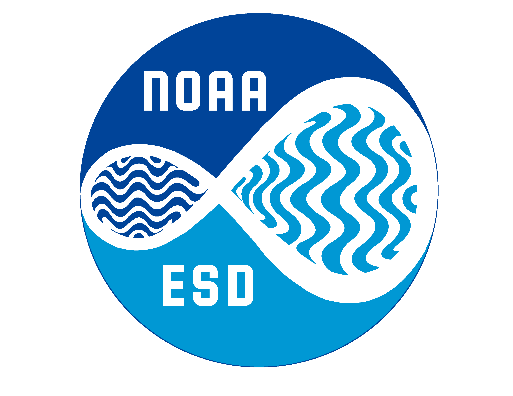
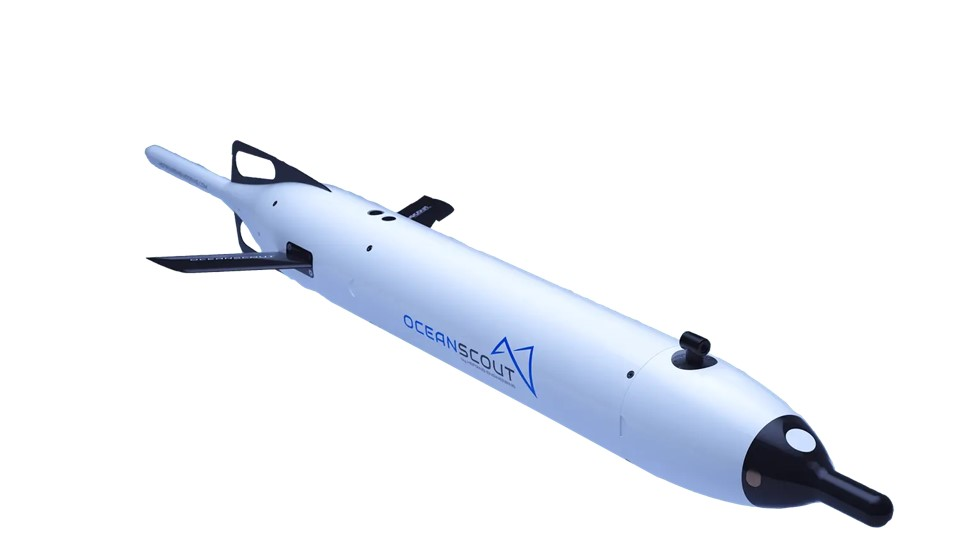

 {style="float:right;" fig-alt="Ecosystem Science Division logo. Artwork by Jen Walsh." width="401"}

The Ecosystem Science Division (ESD) at the [Southwest Fisheries Science Center](https://www.fisheries.noaa.gov/about/southwest-fisheries-science-center){target="_blank"} deploys gliders in both the California Current Ecosystem and the Antarctic Peninsula regions. The ESD's glider fleet is managed by the Scientific Operations and Support (SOS) Program, and supports several research objectives within the ESD. The ESD provides expertise across multiple autonomous platforms to deliver robust data for ecosystem monitoring and fisheries management.

This website is an in-development manual for all ESD glider activities. Please contact a member of the glider team with any questions. For information about active or past ESD glider deployments, see [Deployments](content/deployments.qmd)

## Team Members

| Name | Job Title | Glider Team Role |
|-----------------|---------------------|-----------------------------------|
| [Anthony Cossio](mailto:anthony.cossio@noaa.gov) | Operations Research Analyst | Lab Manager, Pilot, Tech |
| [Jen Walsh](mailto:jen.walsh@noaa.gov) | Fisheries Research Biologist | Pilot, Tech |
| [Tegan Murray](mailto:tegan.murray@noaa.gov) | NOAA Corps ESD Operations Officer | Pilot, Tech |
| [Sam Woodman](mailto:sam.woodman@noaa.gov) | Biologist | Data Manager |
| [Kourtney Burger](mailto:kourtney.burger@noaa.gov) | Glider Specialist | Pilot, Tech |
| [Heidi Taylor](mailto:heidi.taylor@noaa.gov) | Program Lead, SOS; Acting Director, ESD |  |

## Gliders

For most current Fleet Status information, see [this Sheet](https://docs.google.com/spreadsheets/d/1tB3QNKYx8qOYYS9QZotekBAx0y-_n2d-EZPjFFdYNuU/edit?usp=sharing){target="_blank"} (NOAA internal). Also to keep track of RMAs and generalized deployments.

### [Slocum Gliders](https://www.teledynemarine.com/en-us/products/Pages/slocum-glider.aspx){target="_blank"} {width="97"}

NOAA’s Southwest Fisheries Science Center began deploying Teledyne Webb Research Slocum G3 gliders to study Antarctic krill in 2018. The fleet as well as the sensors on the gliders have expanded through the years. Current sensors include CTD, echosounder, AZFP, ECOPuck, cameras, oxygen optode, BSIPAR, and PAM systems.

### [Oceanscout](https://www.hefring.com/oceanscout){target="_blank"} {width="149"}

The ESD started using the Hefring OceanScout gliders in 2025. They are a smaller glider than the Slocum G3s and currently have a CTD and a WISPR PAM sensor.

## Google Drive

The ESD Glider Team uses a shared Google Drive folder to store documents, notes, etc.

[AMLR Gliders Folder](https://drive.google.com/drive/u/0/folders/1wv2wGgWco_3heUR7JPVMc3KLGFCzkcBT){target="_blank"} - Where most things are stored on Google Drive with regards to gliders.

## Project Management

The ESD glider team is using GitHub Issues and Projects for project management. Their efforts are heavily inspired and influenced by the Openscapes [GitHub for project management](https://openscapes.github.io/series/core-lessons/github/github-issues.html){target="_blank"} approach.

### GitHub Project Board

The [ESD glider team project](https://github.com/orgs/SWFSC/projects/5/views/1){target="_blank"} pulls issues from several repositories, but in particular the [SWFSC/glider-lab repo](https://github.com/SWFSC/glider-lab){target="_blank"}. For more details on project communication see the [best practices](content/best-practices.qmd) page.

### GitHub Repositories

GitHub repos developed or used by the ESD glider team. Issues for these repos are tracked in the [ESD glider team project board](https://github.com/orgs/SWFSC/projects/5/views/1){target="_blank"}.

| Repo Link | Description |
|---------------------------------|---------------------------------------|
| [glider-lab-manual](https://github.com/SWFSC/glider-lab-manual){target="_blank"} | ESD Glider lab website; docs used to generate this site |
| [glider-lab](https://github.com/SWFSC/glider-lab){target="_blank"} | All things glider lab; issues/tasks, calibration docs, config files, deployment reports, etc. |
| [standard-glider-files](https://github.com/SWFSC/standard-glider-files){target="_blank"} | ESD glider cache files, as well as standard files that are put on all gliders before deployment |
| [esdglider](https://github.com/SWFSC/esdglider){target="_blank"} | A Python toolbox for processing ESD glider data |
| [echoview_glider_template](https://github.com/SWFSC/echoview_glider_template){target="_blank"} | Echoview glider templates that are used for active acoustic data analysis |
| [glider_processing_code](https://github.com/SWFSC/glider_processing_code){target="_blank"} | Compilation of code that is used to work with glider active acoustic data |
| [slocumRtDataVisTool](https://github.com/SWFSC/slocumRtDataVisTool){target="_blank"} | Creates plots and generates useful statistics from real-time slocum binary files |
| [pam-glider](https://nmfs-ost.github.io/PAM-Glider/){target="_blank"} | NOAA Fisheries Passive Acoustics equipped Glider Research |
